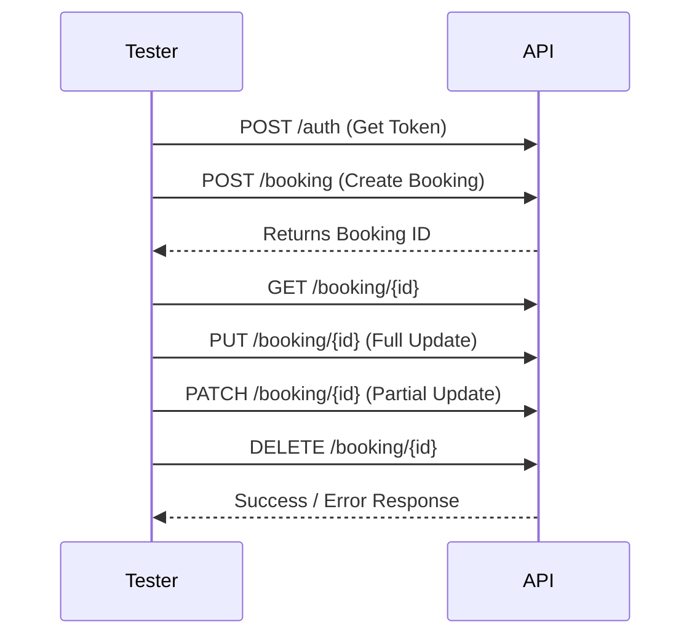

# 🏨 RESTful Booker API – Manual Testing


## 📌 Project Overview

This project demonstrates **end-to-end REST API Testing** on a sample hotel booking API.

👉 [Restful-Booker](https://restful-booker.herokuapp.com/apidoc/index.html)

It covers **CRUD operations (Create, Read, Update Full, Update Partial, Delete)** along with **Authentication, Negative Scenarios, Boundary Value Cases, and Performance Testing**.
The focus is to showcase **end-to-end API validation skills** using **Postman collections** and related test scenarios.

---

## 🚀 Features Covered

* 🔑 **Authentication & Security** – Token-based login, unauthorized access checks 
* 📖 **CRUD Operations** – Create, Get, Update (Full & Partial), Delete bookings 
* ❌ **Negative Scenarios** – Invalid IDs, invalid data types, missing fields 
* 📊 **Boundary Value Cases** – Large payloads, empty requests, special chars, high price values 
* ⚡ **Performance Testing** – Response time validation under different loads 

---

## 🛠️ Tools & Tech Stack

* **Manual Testing** – Postman (Collections & Runner)
* **Documentation & Tracking** – Excel (Test Cases + RTM)
* **Version Control** – GitHub

---

## 📂 Repository Structure

```bash
📦 restful-booker-api-testing
 ┣ 📂 Postman Collections   # Exported Postman collections
 ┣ 📂 TestCases             # Excel test cases + RTM
 ┣ 📂 Reports               # Test execution & performance results
 ┣ 📜 README.md             # Project documentation
```

---

## 📊 Test Scenarios Covered

✔ Authentication (valid/invalid)    
✔ Create Booking (valid, missing fields, invalid types)    
✔ Read Booking (valid & invalid IDs)    
✔ Update Booking – Full (PUT) & Partial (PATCH)   
✔ Delete Booking (valid, already deleted, unauthorized)   
✔ Negative Testing (bad requests, unauthorized, invalid inputs)   
✔ Boundary Value Testing (large payloads, empty, max values, special chars)    
✔ Performance Testing (Response time checks under load & stress)    

---

## 📸 API Flow (Mermaid Diagram)



---

## 🌟 Outcome

This project validates **API testing expertise** across multiple dimensions – functional, negative, boundary, and performance.
It demonstrates strong skills in **Postman, Test Case Design, RTM, and Response Time Validation**, making it a complete showcase of real-world API testing.

---

## 🙋‍♂️ Let's Connect

Feel free to explore, fork, or suggest improvements!  
📧 [sharvarimehta97@gmail.com] | 💼 [linkedin.com/in/sharvarimehta]
